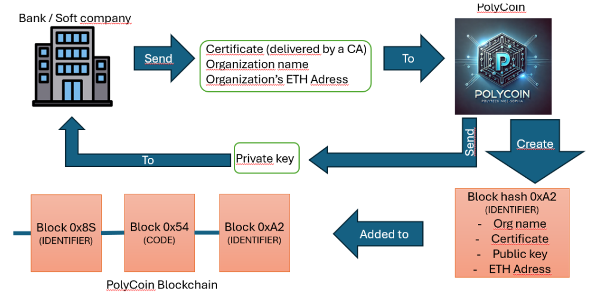
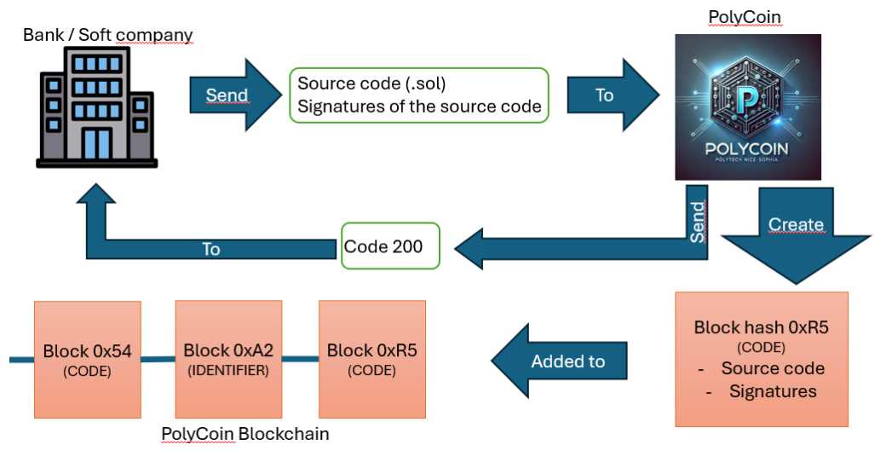
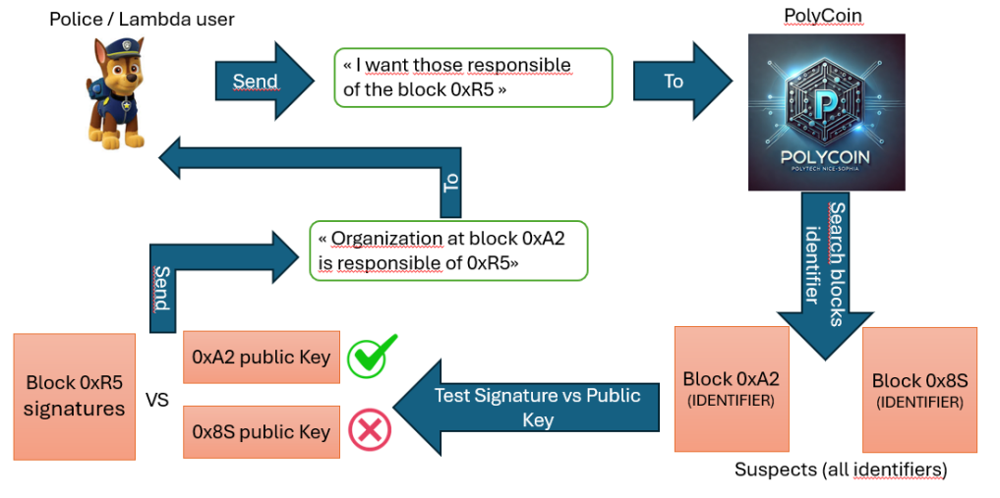

# PolyCoin
 
## Team members:
- BEUREL Simon (5th year engineer student at Polytech Nice Sophia)
- DUMANOIS Arnaud (5th year engineer student at Polytech Nice Sophia) 
- LIQUORI Luigi (Researcher at the INRIA laboratory)

## Description
The PolyCoin project is the result of a 6-month research work carried out by Simon BEUREL and Arnaud DUMANOIS on the subject presented by Liquori LUIGI (Lecturer-Researcher at INRIA): (Semi)Decentralized Digital Currencies and Mutable Smart Contracts for Permissioned Blockchains Distributed Ledgers for the European Area.

The goal of this project is to propose a blockchain allowing to permanently monitor the evolution of ethereum smart contracts published by different companies. Thanks to this project, it is also possible to find the different managers of a smart contract thanks to the cryptographic signature mechanism.

If you need more details, you can find the state of the art carried out at the beginning of this project here: [State of the art](doc/Etat_de_lart_DUMANOIS_BEUREL.pdf)


## Context
Versioning is defined by Wikipedia as "the process of assigning unique version names or version numbers to unique states of computer software”. In this part we will detail the importance of having a smart contract versioning system, the flaws related to these contracts and we will present our project named “PolyCoin”

### Smarts-contracts security
Ethereum smart contracts are responsible for millions or even billions of dollars worldwide, so ensuring flawless security is one of the main elements when creating them, especially since these contracts are immutable, meaning that once they are deployed, it is impossible to change the source code on the blockchain.
This poses a real problem, because the immutability characteristic of smart contracts is a barrier to a developer wishing to repair source code containing a significant security flaw.

## PolyCoin 
During our project, we realized that the proposed solutions, such as proxy templates for example, did not allow us to keep an important element in the legal field: Traceability. Indeed, more and more governments around the world want to be able to keep a written/digital record of all changes made to software, food, etc. This traceability, Blockchain technology greatly meets it, because it allows us to save transactions (here change of states) permanently
by guaranteeing that no one will be able to alter the blocks already built. This is why we decided to create our own versioning solution: PolyCoin. This solution is a blockchain allowing us to keep in memory within the blocks the different modifications made to a smart contract (new version), but it also allows us to find the legal entities or individuals who were included in the development of a smart contract.
### Structure
The PolyCoin blockchain has two types of blocks. The first type is called the IDENTIFIER block, it allows you to enter information about a legal entity or natural person by entering their name, their electronic certificate issued by a certification authority and the address of their wallet on the Ethereum blockchain.



The second type of block present in PolyCoin is called the CODE block. This block corresponds to a version of a smart contract that has been developed by a legal or natural person already registered within the PolyCoin blockchain. To be able to create this block, the entities responsible for the contract must each sign it with their private keys, then, one of the entities will provide PolyCoin with the source code of the contract as well as the different signatures to be able to create this new block.



The core of the PolyCoin project is to use the principle of cryptographic signature to find out who is at the origin of a CODE block corresponding to a version of a smart contract. As shown in Figure 6, to achieve this principle, PolyCoin can simply search among all the public keys assigned to the IDENTIFIER blocks, which allow to verify a CODE block in question. Thus, PolyCoin makes it possible to respond to two problems related to smart contracts: How to keep effective track of the evolution of a smart contract and how to find those responsible in the event of a security breach?


## Technological aspects

This project was developed using Python 3.10 technology. We chose to carry out this project in Python because it is the programming language in which we are most competent, and thanks to the vast availability of libraries it is possible to extend the project by integrating new functionalities.

Currently the project is a Client-Server project as we use the Flask python library. We are currently switching the project to a P2P program to align with the major blockchains in the world.

### Launch the project
To install the libraries:
```shell
pip3 install -r requirements.txt
```

To launch the project on the port 5000:
```shell
python3 app.py
```

To launch the different tests:
```
pytest
```

## Flask's endpoints

### 1. Mine Block with Source Code
- **Route**: `/mine_block_code`
- **Method**: GET
- **Parameters**:
  - `source_code`: Source code to store in the block
  - `signature`: Signature of the source code
- **Description**: Creates a new block in the blockchain containing the source code and its signature
- **Returns**: The created block (200) or error if parameters are missing (400)

### 2. Mine Block with Identifier
- **Route**: `/mine_block_identifier`
- **Method**: GET
- **Parameters**:
  - `name_organization`: Organization name
  - `certificate`: Certificate
  - `walletETH`: Ethereum wallet address
  - `public_key_str`: Public key as string
- **Description**: Creates a new identification block in the blockchain
- **Returns**: The created block (200) or error if organization already exists or parameters are missing (400)

### 3. Get Chain
- **Route**: `/get_chain`
- **Method**: GET
- **Parameters**: None
- **Description**: Retrieves the entire blockchain
- **Returns**: The complete chain and its length (200)

### 4. Verify Block Signature
- **Route**: `/verify_block_signature`
- **Method**: GET
- **Parameters**:
  - `block_hash`: Hash of the block to verify
- **Description**: Verifies the signature of a CODE type block and identifies the corresponding organization
- **Returns**: Organization name if signature is valid (200) or error if no organization found (400)


